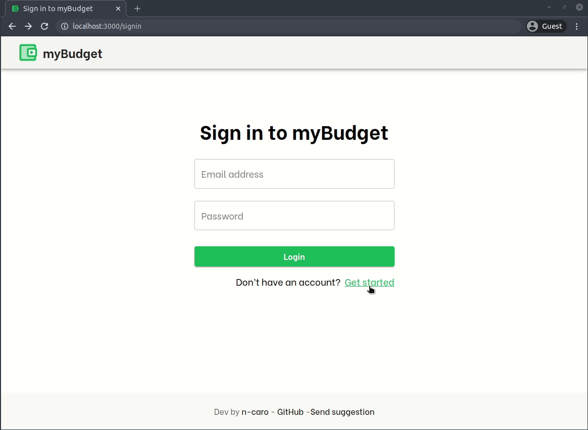
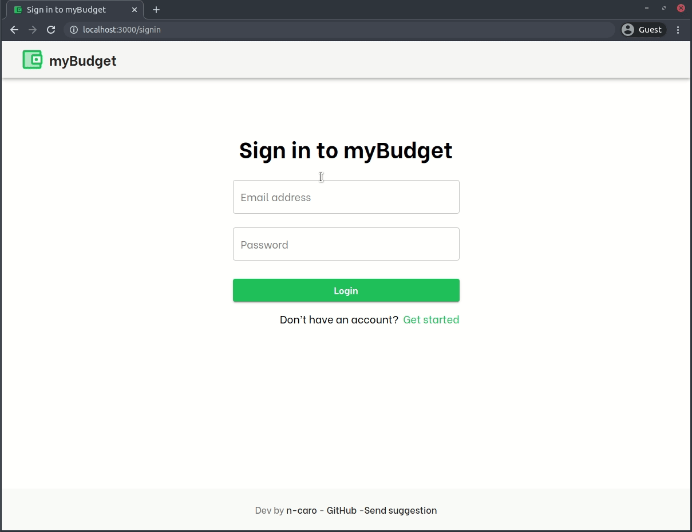
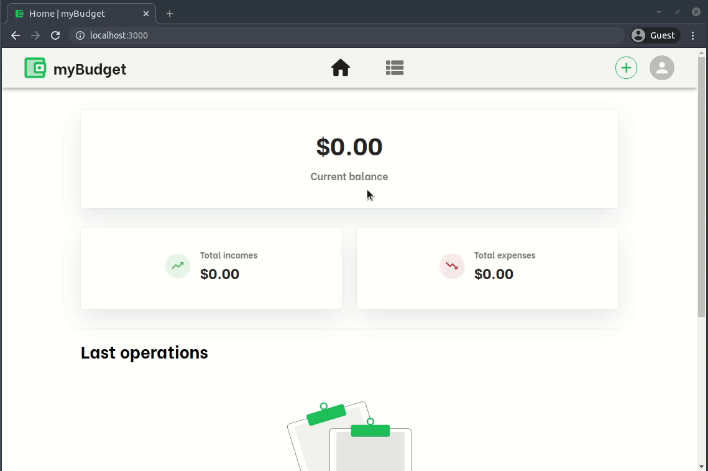
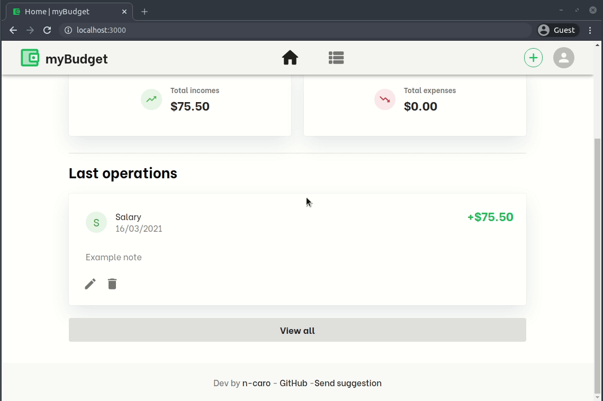
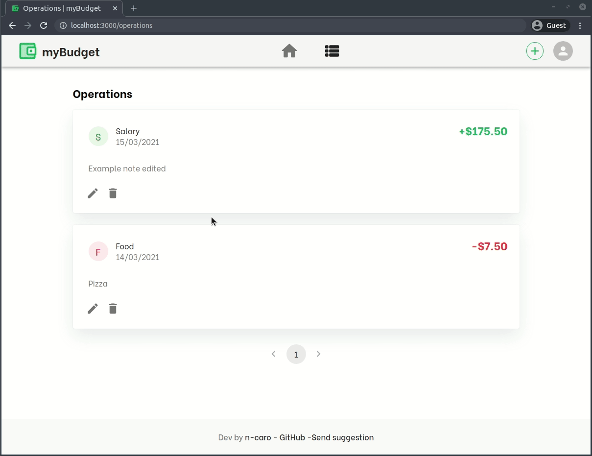
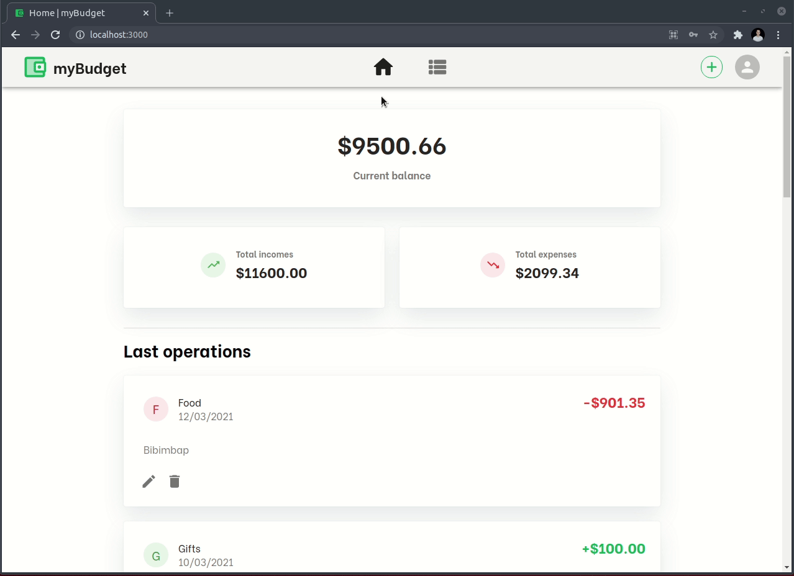
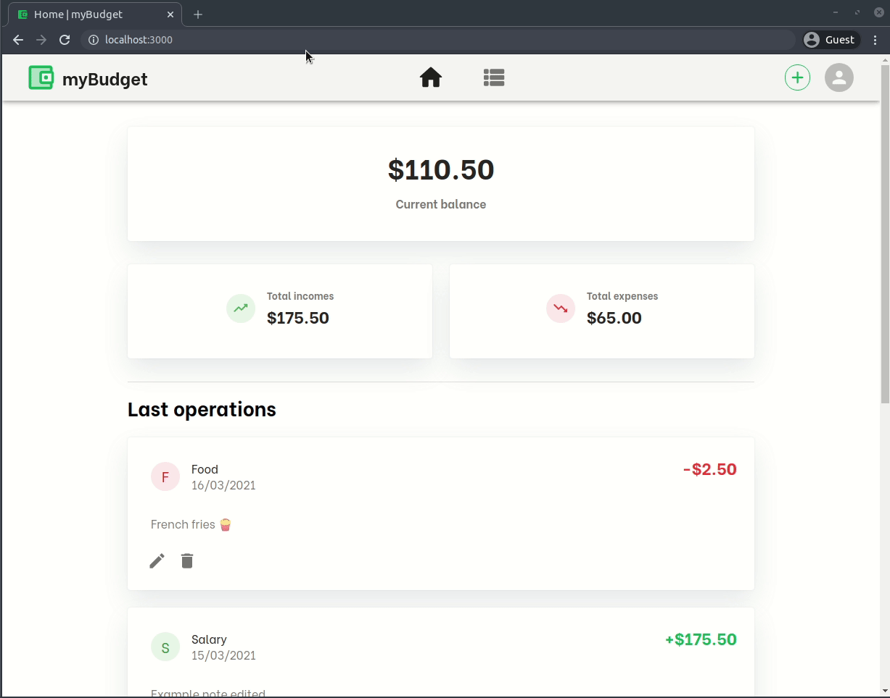

# Expense Tracker-app

## Overview

A personal budget management 💸 web app built in React and Material UI and **Expense Tracker-api**

This is the frontend (client side) of the Expense Tracker app. To see the backend API (server side) visit the repository: [github.com/n-caro/Expense Tracker-backend](https://github.com/n-caro/Expense Tracker-backend)

## 1. About Expense Tracker

Some features and dependencies:

- 🎨 Material UI and Material UI icons.
- Axios for API calls
- Form validations with Formik
- React router doom.

## 2. Features

- User registration and authentication
- Create operations of type Income or Expenses
- Edit operations that have already been created
- Delete operations
- View account balance (current balance, total incomes, total expenses)
- List of all operations, with pagination

## 2. Install and usage

#### Install

```shell
#clone the repository and go

$ git clone https://github.com/n-caro/Expense Tracker-frontend.git
$ cd Expense Tracker-frontend

#Install dependencies (yarn recommended)
$ yarn install

#or npm
$ npm install
```

After install dependencies, create a .env file (you can rename `.env.example` file) and set the URL for Expense Tracker-api ([github.com/n-caro/Expense Tracker-backend](https://github.com/n-caro/Expense Tracker-backend))

**.env (example):**

```
REACT_APP_APIURL = http://localhost:4000/api
```

#### Usage

```shell
$ yarn start

#or npm
$ npm start
```

And go to http://localhost:3000

## 3. Screenshots

###### Sign up (and validations)



###### Sign in (and validations)



###### Add operation



###### Edit operation



###### Delete operation



###### Operations (and pagination)



###### Menu



## 4. Upcoming Features

- Operations: Filter by type
- Operations: Select limit of results per page
- Loading bar when API calls are made
- Store and Actions for Operations (Redux or UseContext and useDispatch)
- Animations for route change and data loading
- Reports page (graphs) [Requires API update]
